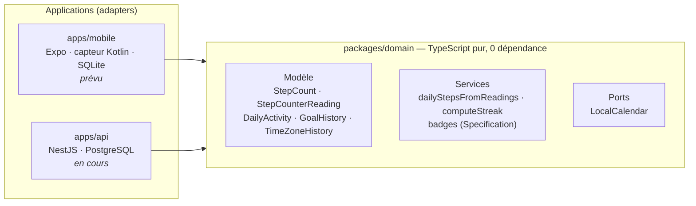

# StepByStep

[](https://github.com/GregoireChevalierACS/StepByStep/actions/workflows/ci.yml)
[](https://github.com/GregoireChevalierACS/StepByStep/actions/workflows/codeql.yml)

Application Android de comptage de pas (Samsung Galaxy S22), écrite en **TypeScript** et développée en **TDD**, autour d'un domaine métier pur partagé entre le téléphone et un serveur de synchronisation optionnel.

| Indicateur (domaine)   | Valeur                                                                     |
| ---------------------- | -------------------------------------------------------------------------- |
| Tests                  | 192, en moins d'une seconde                                                |
| Couverture             | 100 % (lignes, branches, fonctions), imposée en CI                         |
| Score de mutation      | 100 % ([Stryker](https://stryker-mutator.io)), seuil bloquant à 80 % en CI |
| Dépendances du domaine | aucune                                                                     |

## Le problème métier

Le téléphone fournit un compteur matériel de pas (`TYPE_STEP_COUNTER`) **cumulé depuis le dernier démarrage**. L'application relève ce compteur régulièrement et en déduit les pas de chaque jour. Les difficultés sont toutes métier :

- le compteur **repart à zéro** à chaque redémarrage, ce qu'on détecte grâce au numéro de démarrage Android (`BOOT_COUNT`) ;
- les pas faits entre deux relevés qui encadrent **minuit** sont répartis **au prorata du temps**, sans perdre ni inventer un seul pas ;
- les relevés peuvent arriver **en retard, en double ou dans le désordre** (synchronisation hors ligne) : le résultat doit rester identique ;
- le **fuseau horaire** de l'appareil change en voyage, et l'**objectif quotidien** peut changer sans réécrire les séries passées.

Ces règles vivent dans `packages/domain`, testées par l'exemple, par propriétés ([fast-check](https://fast-check.dev)) et par mutation.

## Architecture

Architecture **hexagonale** (ports et adapters) : les dépendances pointent toujours vers le domaine, qui ne connaît ni React, ni Expo, ni NestJS, ni aucune base de données.



La règle est vérifiée automatiquement : ESLint interdit au domaine d'importer un framework ou une couche d'infrastructure.

## Démarrer

Prérequis : Node 22, pnpm 10.

```bash
pnpm install
pnpm test            # tous les tests
pnpm test:coverage   # tests + couverture (seuil 100 % sur le domaine)
pnpm test:mutation   # test de mutation Stryker du domaine (~1 min)
pnpm lint && pnpm typecheck && pnpm format:check
```

## Qualité et garde-fous

| Niveau              | Outil                                                                                                                        |
| ------------------- | ---------------------------------------------------------------------------------------------------------------------------- |
| Typage              | TypeScript `strict` + `noUncheckedIndexedAccess`, `exactOptionalPropertyTypes`, `verbatimModuleSyntax`                       |
| Lint / format       | `typescript-eslint` (`strictTypeChecked`), Prettier                                                                          |
| Avant chaque commit | Husky + lint-staged + commitlint (format `aaaa-mm-jj # N : (type) message`)                                                  |
| Tests               | Vitest, fast-check (propriétés), Stryker (mutation)                                                                          |
| CI (GitHub Actions) | audit des dépendances, commitlint, lint, format, types, tests + couverture, mutation ; `main` protégée (PR + CI obligatoire) |
| Sécurité            | CodeQL, Dependabot (dépendances et actions)                                                                                  |

Erreurs métier sous forme de `Result<T, E>` plutôt que d'exceptions, Value Objects immuables validés à la création, invariants garantis par le type (historiques jamais vides).

## Décisions et feuille de route

- [ADR 0001](docs/adr/0001-historique-sans-health-connect.md) : historique construit par l'application, sans Health Connect.
- [ADR 0002](docs/adr/0002-serveur-de-synchronisation-optionnel.md) : serveur de synchronisation optionnel (NestJS + PostgreSQL).
- [ROADMAP](ROADMAP.md) : phases, patterns et stratégie de tests.

| Phase                                                      | État        |
| ---------------------------------------------------------- | ----------- |
| 0. Fondations (monorepo, CI, débogage sans fil)            | en partie   |
| 1. Domaine en TDD                                          | ✅ terminée |
| 8. Serveur de synchronisation NestJS                       | en cours    |
| 2 à 5. Cas d'usage, adapters, écrans, arrière-plan mobiles | à venir     |
